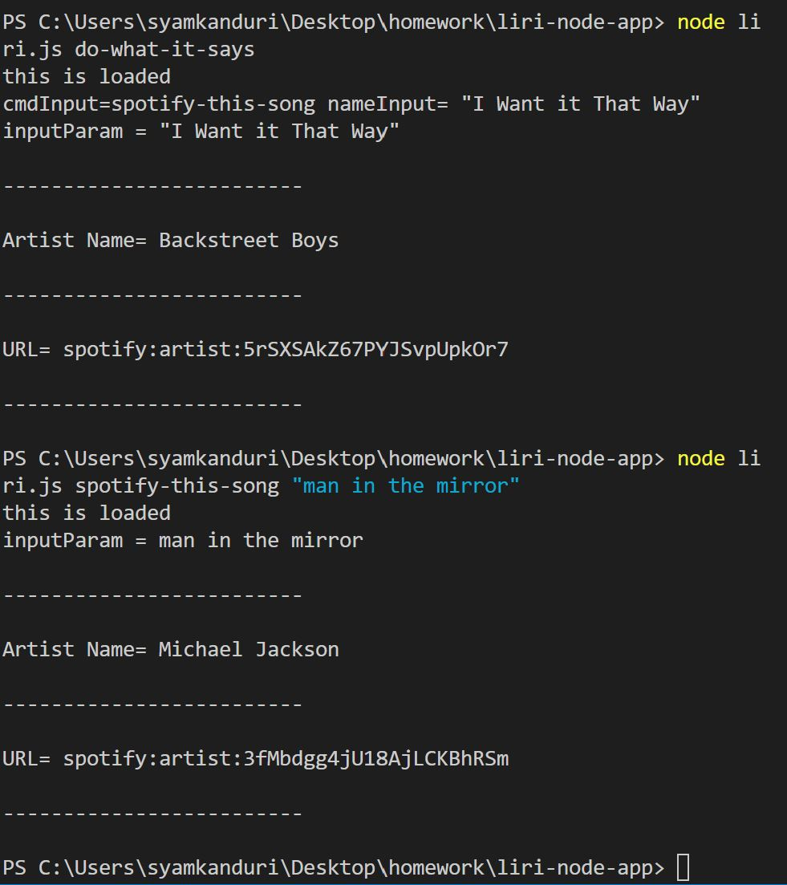

# liri App

<!-- Put the name of the project after the # -->
<!-- the # means h1  -->
# Homework # 7- liri App

<!-- Put a description of what the project is -->
To develop a small app using node.js. 

# Link to deployed site
<!-- make a link to the deployed site --> 
<!-- [What the user will see](the link to the deployed site) -->


# Images
<!-- take a picture of the image and add it into the readme  -->
<!--  -->



# technology used
<!-- make a list of technology used -->
<!-- what you used for this web app, like html css -->

node.js
<!-- 
1. First ordered list item
2. Another item
⋅⋅* Unordered sub-list. 
1. Actual numbers don't matter, just that it's a number
⋅⋅1. Ordered sub-list
4. And another item. 
-->


# code snippets
<!-- put snippets of code inside ``` ``` so it will look like code -->
<!-- if you want to put blockquotes use a > -->

```
It wasn't really lot of coding. It was the setting up environment and packages took time. 
    
if (process.argv.length === 3 && cmdInput === "movie-this"){
  nameInput = "Mr. Nobody.";
  movieThis(nameInput);
}
else if (process.argv.length === 3 && cmdInput === "spotify-this-song"){
  nameInput = "The Sign";
  spotifyThis(nameInput);
}
else if (process.argv.length === 3 && cmdInput === "do-what-it-says"){
  doWhatItSays();
}
if (process.argv.length === 4){
  nameInput = process.argv[3];
}
if (process.argv.length === 4 && cmdInput === "movie-this"){
  movieThis(nameInput);
}
if (process.argv.length === 4 && cmdInput === "concert-this"){
  concertThis(nameInput);
}
if (process.argv.length === 4 && cmdInput === "spotify-this-song"){
  spotifyThis(nameInput);
}

```


# Learning points
<!-- Learning points where you would write what you thought was helpful -->
setting up environment

# Author 
Syam Kanduri

# License
Standard MIT License